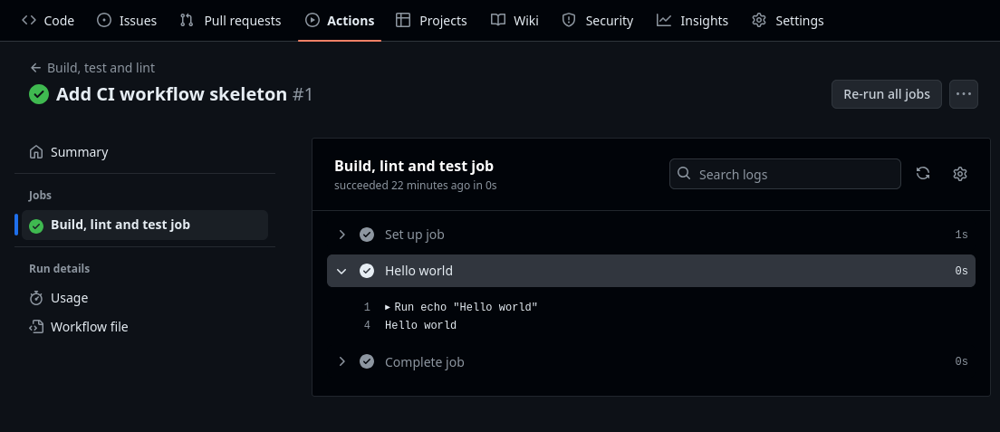
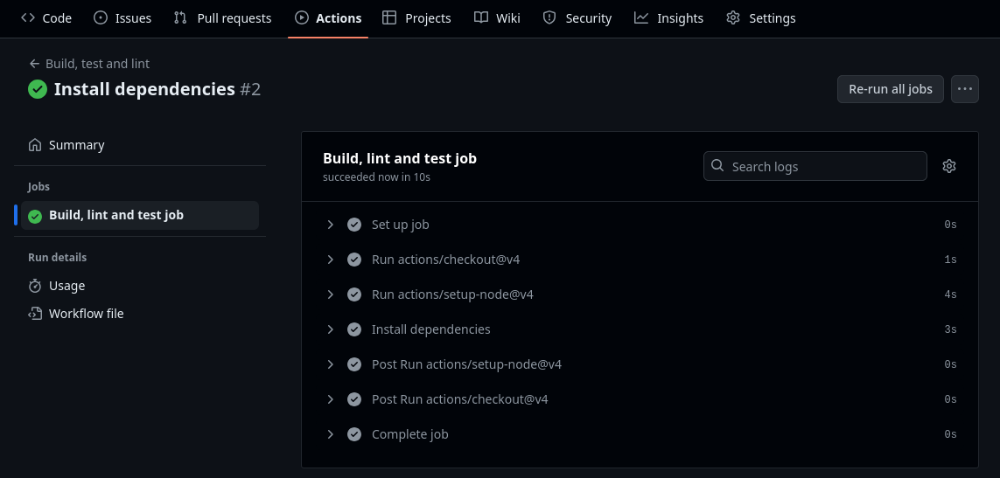
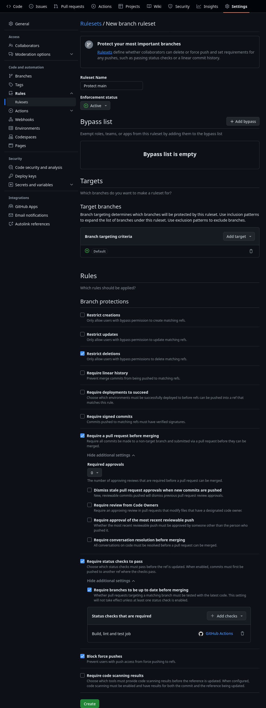
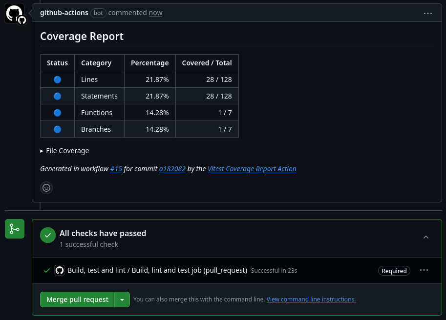

# React CI Tutorial

This tutorial will let you build a Continuous Integration (CI) workflow for
front-end app written React.
The resulting setup will be suitable for [GitHub Flow](https://githubflow.github.io/).

This repository contains the application code you will build the CI workflow
around.
The sample application in this repository is written in TypeScript and uses Vite
to build.

In this tutorial you will:

- Create a workflow from your IDE
- Add steps to install dependencies, build, lint, test
- Use an action to show test coverage report on pull-requests
- Add branch protection

## Getting started

1. Click on the green "Use this template" button at the top
2. Then select "Create a new repository"


3. Click "Create repository from template"
4. Type a repository name and click "Create Repository"
5. Make a local clone the repository following the instructions [here](https://docs.github.com/en/repositories/creating-and-managing-repositories/cloning-a-repository)
6. Open your local clone in WebStorm or another editor

## Initial workflow

To start things off, let's create a new workflow.

Create a new file `.github/workflows/ci.yml` by right-clicking on project folder
in **Project** panel.
Then _New_ -> _File_ and type the path.


Add the following content:

```yml
name: Build, test and lint
on:
  push:
    branches: ["main"]
  pull_request:
    types: [opened, synchronize, reopened, closed]
    branches: ["main"]
jobs:
  frontend_build_lint_test_job:
    runs-on: ubuntu-latest
    name: Build, lint and test job
    steps:
      - name: Hello world
        run: echo "Hello world"
```

The YAML code is just a simple skeleton workflow with a single step that outputs
"Hello world".

The workflow will execute on push and pull-requests to **main** branch.

For now, we will commit directly to **main** branch.
Later on, branch protection will be added such that changes to **main** can only
happen via pull-requests.

In the terminal do:

```sh
git add .github
git diff --cached
# review you changes
git commit -m 'Add ci workflow skeleton'
git push
```

> [!TIP]
> You can exit `git diff` by pressing "q" on your keyboard.

Head over to the repository on GitHub and go to the "Actions" tab.
Observe the workflow execute.


1. Click on the workflow run to see all the jobs in the workflow. In our case
   there is only one.
2. Click on the job to see each step.
3. Click on the "Hello world" step to view log.



## 1. Dependencies

Before we can do anything useful in the workflow we need to install the
dependencies for the project.

### Dependency resolution

Dependencies are defined in `package.json`.
Dependencies are resolved to exact version using
[semantic versioning](https://docs.npmjs.com/about-semantic-versioning) rules.

If a dependency has a version `3.2.1` then follows:

| Number | Meaning       | Compatibility                             |
| ------ | ------------- | ----------------------------------------- |
| `3`    | Major release | Changes that break backward compatibility |
| `2`    | Minor release | Backward compatible new features          |
| `1`    | Patch release | Backward compatible bug fixes             |

Dependencies are often specified as `^3.2.1`, meaning latest release without
breaking changes that are equal to or newer than the specified version.
The resolved version could be `3.2.2` or `3.3.0`, but not `4.0.0`.

When you run `npm install` it will attempt to resolve and install compatible
version of all dependencies including dependencies of dependencies.

The resolved dependencies and exact versions are stored in `package-lock.json`.

Installing dependencies with `npm clean-install` will make sure only the exact
versions of dependencies specified in `package-lock.json` is installed.

Using `npm clean-install` allows two builds on the same commit to produce the
same output.
Meaning we have version control of our build output without storing it.

### Change workflow

In your `ci.yml`, replace:

```yml
- name: Hello world
  run: echo "Hello world"
```

With:

```yml
- uses: actions/checkout@v4
- uses: actions/setup-node@v4
  with:
    node-version: "22"
- name: Install dependencies
  run: npm clean-install
```

_NOTE: make sure the snippet is correctly indented like [this](https://gist.github.com/rpede/2bcc08d1be864f0d6620e57d7aa2897a)._

The `actions/checkout` action will checkout the commit for which the workflow is run.

`actions/setup-node` makes the specified version of node.js (including npm)
available.

After you've made the changes, commit and push.
Then head over to the repository on GitHub.
Open "Actions" tab and verify that it worked.



## 2. Build

Let's modify the workflow to do something actually useful.

Here we will have it transpile (aka build) the TypeScript source code of the
application to JavaScript.

If it can't even build the code, it means that someone definitely screwed up, and
we would like to know as early as possible.

Just add the following step to `ci.yml`:

```yml
- name: Build
  run: npm run build
```

_NOTE: make sure the indentation is correct._

Commit and push to see it in action.


Oh snap, the build is broken.

Create a feature branch and see if you can fix it.
First create a new branch for fixing the build:

```sh
git checkout -b fix/build
```

Install dependencies with `npm ci` you can test the build using `npm run build`
command.
See if you can fix the error.

> [!TIP]
> error TS6133: 'PostModel' is declared but its value is never read.

When you have the build working on your computer it's time to push the branch
to the remote repository.

```sh
# Stage your changes
git add -A
# Review your staged changes.
git diff --cached
# Now, commit with a helpful message
git commit -m 'Write a helpful commit message'
# Push your local branch to the remote repository
git push --set-upstream origin fix/build
```

> [!TIP]
> Lines starting with # are comments, not commands and should be skipped when
> you type the commands in your terminal.

> [!IMPORTANT]
> Notice the branch name at the end of `git push --set-upstream origin
> fix/build`.
> It should match the name of the branch you are trying to push.

Create then merge a pull-requests from `fix/build` branch.


Verify that you fixed the build by observing that the workflow check passed.


If not, commit and push another change to same branch.
You can merge the pull-request once you've fixed the issue.


After the pull-request have been merged, you should do:

```sh
git checkout main
git pull
```

> [!IMPORTANT]
> To make sure that your local version of main contains the merged changes
> before proceeding.

## 3. Lint

Let's expand a bit and make sure the code is also up to standard.
We can do that with [eslint](https://eslint.org/).

**eslint** is something called a [linter](<https://en.wikipedia.org/wiki/Lint_(software)>).
Linters are tools that can analyze source code for potential errors.
They can also enforce stylistic rules for the source code to make sure the
coding style is uniform.

When you create a vite-react project, it already comes preconfigured with eslint.

## Change workflow

Simply add the following to your `ci.yml`:

```yml
- name: Lint
  run: npm run lint
```

> [!TIP]
> Make sure the indentation is correct.

> [!NOTE]
> When we are making changes to our CI workflow, we do this directly in the
> **main** branch.
> That is because the workflow is supposed to help us prevent breaking changes
> on **main**, so we need the checks defined on that branch.

Commit and push your changes to main branch.
Go to GitHub and look at the output of your workflow.

Oh, no. Another failure.
Can you fix it?

Create another feature branch for your fix using same procedure as before.

```sh
git checkout -b fix/lint
```

You can run lint checks locally with `npm run lint` command.
The output should tell how you can fix the issue.

> [!TIP]
> When you see `7:3  error` it means to look at line 7, 3rd character.
> Note that white-space also counts as text characters.

When you have fixed the issue, do:

```sh
# Stage your changes
git add -A
# Review your changes
git diff --cached
# Commit changes
git commit -m 'Describe how you fixed linting'
# Push to remote repository
git push --set-upstream origin fix/lint
```

After:

1. Create a pull request on GitHub as before by clicking "Compare &
pull-request".
2. Then "Create pull request"
3. Verify that all checks pass.
4. Now you can merge by clicking "Merge pull request"

> [!IMPORTANT]
> Remember to change back to **main** and update your local version of the
> branch when you are done.

```sh
git checkout main
git pull
```

## 4. Test

You can only do so much with static code analysis.
It can't tell if the code actually does what it is supposed to.
We need to execute the code for that.

For that we need to write tests.
Luckily, the sample app already has some tests.
So, let's execute them as part of the workflow.

### Modify the project

[Vite.js](https://vitejs.dev/) is used to build the app and there is a testing
framework for it called [Vitest](https://vitest.dev/) that we will use.

We can install it with:

```sh
npm install -D vitest
```

The `-D` means that it is a development dependency.

Then add the following in the `scripts` section in `package.json`:

```json
    "test": "vitest --run"
```

It allows you to run the tests with the `npm run test` command.

The sample application already contains a test.
However, it is out-commented.
So, open `src/api.test.ts` and remove the `/*` and `*/`.

Shortcut: <kbd>Ctrl</kbd> + <kbd>a</kbd> then <kbd>Ctrl</kbd> + <kbd>Shift</kbd> + <kbd>/</kbd>.

Run `npm run test` and you should now see one test passing.

### Change workflow

Simply add the following to `ci.yml`:

```yml
- name: Test
  run: npm run test
```

_NOTE: make sure the indentation is correct._

Stage your changes, commit and push!

## 5. Test coverage

Generally, each test only tests part of the application code.
So, how can you tell if your tests combined have covered enough of the
application code?

To answer that question, we need to generate a coverage report.
It can tell you what lines of your application was executed by the tests and
summarize it into a percentage.

Output looks like this:

| Status | Category   | Percentage | Covered / Total |
| :----: | ---------- | ---------: | --------------: |
|   🔵   | Lines      |     21.87% |        28 / 128 |
|   🔵   | Statements |     21.87% |        28 / 128 |
|   🔵   | Functions  |     14.28% |           1 / 7 |
|   🔵   | Branches   |     14.28% |           1 / 7 |

Actually, we get a couple of different numbers.
Here is a quick explanation.

<dl>
<dt>Lines</dt>
<dd>Should be self-explanatory</dd>
<dt>Statements</dt>
<dd>They end with a `;`</dd>
<dt>Functions</dt>
<dd>Also, what it sounds like. Methods count as functions.</dd>
<dt>Branches</dt>
<dd>Whenever the code can take different code paths, like when you have an `if` and `else`.</dd>
</dl>

### Modify the project

The generation of coverage reports can fairly easily be enabled with **Vitest**.

First install a package to support it.

```sh
npm install -D @vitest/coverage-v8
```

Next, change `vite.config.js` to:

```js
/// <reference types="vitest" />
import { defineConfig } from "vite";
import react from "@vitejs/plugin-react";

// https://vitejs.dev/config/
export default defineConfig({
  plugins: [react()],
  test: {
    coverage: {
      // you can include other reporters, but 'json-summary' is required, json is recommended
      reporter: ["text", "json-summary", "json"],
      // If you want a coverage reports even if your tests are failing, include the reportOnFailure option
      reportOnFailure: true,
    },
  },
});
```

Basically, it tells Vite+Vitest to generate a report and a summery in JSON
format and output a report even if there is a failure.

Create an alias for running tests with coverage report by adding the following
to `script` section of `package.json`:

```json
    "test:coverage": "vitest --run --coverage.enabled true",
```

The report will be saved to a file in the `coverage/` folder.
We don't need to commit the reports since they are generated from the code.
Therefore, you should append `coverage/` on a new line in the `.gitignore` file.

You can try it out on your own machine by running `npm run test:coverage` command.

### Change workflow

Wouldn't it be cool if it showed the coverage when reviewing a pull-request for
a feature branch?

We can get the workflow to automatically make a comment with the coverage on
pull-requests.
To make it happen we need to add two things.
First permissions to make the comment.
Second, we will use the
[davelosert/vitest-coverage-report-action](https://github.com/davelosert/vitest-coverage-report-action)
action to post it.

In `.github/workflows/ci.yml`, right after:

```yml
frontend_build_test_and_lint_job:
  runs-on: ubuntu-latest
```

You must add the following:

```yml
permissions:
  # Required to checkout the code
  contents: read
  # Required to put a comment into the pull-request
  pull-requests: write
```

Then change the **Test** step to:

```yml
- name: Test
  run: npm run test:coverage
- name: Report Coverage
  # Set if: always() to also generate the report if tests are failing
  # Only works if you set `reportOnFailure: true` in your vite config as specified above
  if: always()
  uses: davelosert/vitest-coverage-report-action@v2
  with:
    json-summary-path: "./coverage/coverage-summary.json"
    json-final-path: "./coverage/coverage-final.json"
```

Stage the files (`git add -A`) and make sure that the files the `coverage`
folder isn't included (`git diff --cached`).

If you see `coverage/coverage-final.json` or `coverage/coverage-summary.json` it
means that you got something wrong with `.gitignore` file.
You can unstage a file with `git restore --staged <file>`.

When done, commit and push.

Wait for the workflow to complete.
What are the coverage percentage?

## 6. Branch protection

Navigate to the "Settings".
Click "Rules" then "Rulesets" in the left panel.
Click the green "New ruleset" button then select "New branch ruleset" from the
dropdown.

Configure as shown in the screenshot.



Click "Create".

Now all changes to the **main** branch have to be done with a pull-request.
The pull-request can't be merged before the CI workflow we build have succeeded.

You can take it one step further and require the pull-request to have been
approved by other team members or the code owner before it can be merged.

## Try it out

Let's try out everything together.

Create a new branch:

```sh
git checkout -b breaking-change
```

1. Introduce a problem that will make any of CI workflow checks fail.
    - It could be to outcomment a react component such that it can no longer be
build.
2. Commit and push the change.
3. Create a new pull-request.
4. Notice that the "Merge pull request" button is disabled.
5. Fix the change you introduced that made it fail.
6. Commit and push your new change.
7. Look at the pull-request on GitHub



We now have a Continuous Integration workflow for the react app that adds
several checks on any code that goes into the **main** branch.
The goal is to keep **main** in a working state at all times.

Also notice that the action added "Test coverage" sections results in
github-actions bot commenting on the pull-request with a coverage report.

## Closing thoughts

You have now built a reasonable CI workflow for a React frontend application.

The general concepts will apply for other tech-stacks as well.
But the way it is set up will be a bit different.

It is common to also have a workflow to automate deploying the application.
That will be an exercise for later.

[Here](https://gist.github.com/rpede/d9ceade1eca00e4b3bc46141693648e2) are the
main files that we changed, just for reference.
